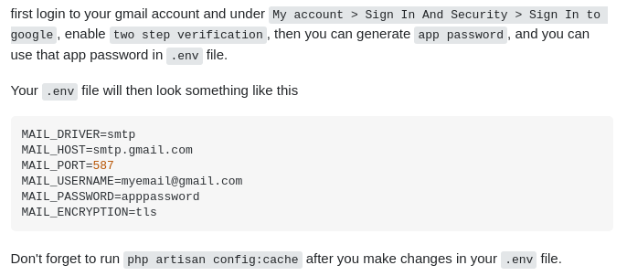

### Setting up:

* Cài đặt: `composer`, `php7.4`, `mysql`

1. Clone project về thư mục chứa code
```  
git clone ... 
```

2. Tạo file config môi trường
```
cp .env.example .env
```

3. Install package.json (via `composer`)
```
composer install
```

4. Tạo key cho project Laravel
```
php artisan key:generate
```

5. Thêm vào file config/app.php
```
'providers' => [
   ...
'Tymon\JWTAuth\Providers\LaravelServiceProvider',
],
'aliases' => [
    ...
    'JWTAuth' => Tymon\JWTAuth\Facades\JWTAuth::class,
     'JWTFactory' => Tymon\JWTAuth\Facades\JWTFactory::class,
],
```
6. Chạy lênh để publish JWT configuration

```
php artisan vendor:publish --provider="Tymon\JWTAuth\Providers\LaravelServiceProvider"
```

7. Chạy command
```
php artisan jwt:secret
```

8. Config email


MAIL_FROM_ADDRESS=youremail@gmail.com
MAIL_FROM_NAME="4room"

8. Chạy migrate tạo bảng cho database
```
php artisan migrate
```

9. Chạy project (mặc định port 8000)
```
php artisan serve
```

### Tạo 1 loại API dựa theo Repository Design Pattern 
1. Tạo file migration định nghĩa cấu trúc table 
2. Tao Models 
3. Tạo Repository (tk này sẽ tương tác trực tiếp với db, mỗi table tương ứng với 1 Repository)
4. Tạo Controller (controller sẽ gọi các hàm trong repository)
5. Tạo route cho api trong file api.php
6. Test trên postman 

Tham khảo thêm: Repository Design Pattern  